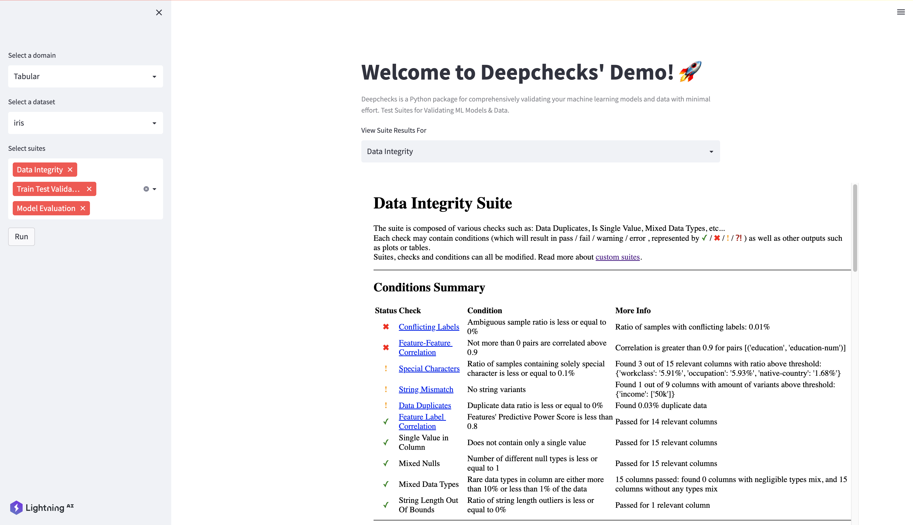

<!---:lai-name: LightningDeepchecks--->

<div align="center">


⚡ Deepchecks App with [Lightning](https://lightning.ai) ⚡

[](https://lightning.ai)


______________________________________________________________________

</div>

## About

...

## Running the app

```bash
conda create --name lightning_deepchecks python=3.8
conda activate lightning_deepchecks

git clone https://github.com/Lightning-AI/LAI-Deepchecks-App
cd LAI-Deepchecks-App
pip install -e .

## To run the app locally
python -m lightning run app app.py

## To run the app on the cloud to share it with your peers and users
python -m lightning run app app.py --cloud
```

## Sneak Peek


